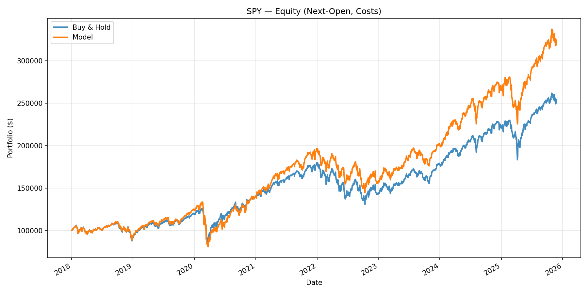

# ML Next-Open Trading Strategy

A complete machine-learning trading system that predicts **Open[t+H] > Open[t]**,  
executes trades at the next market open, and evaluates performance through a fully  
leakage-safe walk-forward backtest with realistic transaction costs.

This repository also includes an optional **live paper-trading module** using Alpaca  
and a one-off **hyperparameter tuning helper** if you want to override default parameters.

---

## 📌 Overview

This project implements a short-horizon supervised machine learning strategy using:

- A compact and robust feature set  
- Strict leakage-safe label construction  
- Rolling walk-forward Gradient Boosting  
- Confidence-based portfolio exposure  
- Optional SMA trend gating  
- A cost-aware next-open backtester  
- Side-by-side comparison to Buy & Hold  
- Optional Alpaca paper trading (live_trader.py)


---

## ✨ Features

- **Leakage-safe engineered features** 
- **Rolling walk-forward retraining** (retrain every N days on most recent window)
- **Fixed-horizon labels** predicting Open[t+H] vs Open[t]
- **Compact high-value technical features**
  - log returns  
  - overnight gaps  
  - 5-day momentum  
  - 20-day realised volatility  
  - RSI-14  
  - SMA-10 & SMA-50  
  - VAM-20 (volatility-adjusted momentum)  
  - 60-day volume percentile rank  
- **Exposure model**
  - Long-only baseline (1.0x)
  - Probability-based tilts  
  - Trend gating (“loose”: 20/100 SMA or “strict”: 50/200 SMA)
  - Max gross leverage cap  
- **Cost model**
  - 0.5 bps commission  
  - 0.2 bps slippage  
- **Deterministic & reproducible** (fixed seeds, consistent data handling)
- **Outputs saved to `artifacts/` folder**

---

## 📂 Project Structure

```text
ml-next-open-trading/
│
├── scripts/
│   ├── main.py              # Full backtest pipeline (run this)
│   ├── live_trader.py       # Optional Alpaca paper trading
│   ├── run_tuning_once.py   # One-off GBM hyperparameter tuner
│
├── data.py                  # Loading & cleaning OHLCV data
├── features.py              # Full feature engineering pipeline
├── model.py                 # Walk-forward Gradient Boosting
├── strategy.py              # Probability → exposure mapping
├── backtest.py              # Cost-aware next-open backtester
├── visualization.py         # Equity curve plotting
├── config.py                # All parameters & settings
│
└── artifacts/               # Auto-created output directory

```

---


## ⚙️ **Installation**

### 1. Clone the repository
 ```
git clone https://github.com/aummonji/ml-open-open-trading.git
cd ml-open-open-trading
```

### 2. Create & activate virtual environment (using uv)
```
pip install uv
uv venv
source .venv/bin/activate     # Windows: .venv\Scripts\activate
```
### 3. Install dependencies

```
uv sync
```
### Or add more packages later:
```
uv add <package-name>
```

## ▶️ Running the Backtest

**Run the entire pipeline:**
```
uv run python scripts/main.py
```
This performs:

Load historical SPY data

Build leakage-safe features + binary target

Train Gradient Boosting model in walk-forward mode

Produce probability-based exposure

Run full next-open backtest with costs

Save equity curve to:
```
artifacts/equity_SPY.png
```
## 📈 Example Output

Simple ML Next-Open Strategy (leakage-safe, costs included)
FAST_MODE=True | START=2018-01-01 | H=5 | TREND=loose
Loaded 1500 rows: 2018-01-02 → 2024-10-15
Direction accuracy (H=5, 0.5 cut): 0.63


DONE

You will also see:

- Final equity
- Total return
- CAGR
- Sharpe ratio
- Annualized volatility
- Max drawdown
- Average absolute exposure

and a saved plot to artifacts/equity_SPY.png, like this: 




## 🧠 Feature Engineering
The model uses compact, high-signal technical features:

- ret_cc_1: close-to-close log return
- gap_oc: overnight open/close log gap
- mom_5: 5-day log momentum
- vol_20: 20-day realised volatility
- rsi_14: Welles-Wilder RSI with EMA smoothing
- sma_10 / sma_50: trend context
- vam_20: 20-day momentum normalized by volatility
- vol_pct: 60-day percentile rank of volume (abnormal volume detection)

All features are strictly shifted to avoid leakage.

## 🤖 Model

- GradientBoostingClassifier (scikit-learn)
- Default parameters or tuned hyperparameters
- Retrained every 10 trading days
- Maximum training window: configurable (e.g., 600–800 rows)

These settings were empirically stable and outperformed tuned alternatives.

## 💼 Strategy Logic (Exposure Model)

- Always hold 1.0x baseline long:
   - If P(up) ≥ 0.55 → add long tilt (up to max_add)
   - If P(up) ≤ 0.45 → reduce long exposure (down to base − max_sub)

- Apply trend gate:
   - loose = 20/100 SMA filter
   - strict = 50/200 SMA

- Enforce max gross leverage

This is more stable than going long/flat/short.

## 🔄 Hyperparameter Tuning (Optional)
The project includes a helper you can run:

```
uv run python scripts/run_tuning_once.py
```
It:

- Uses TimeSeriesSplit

- Performs a small RandomizedSearchCV

- Prints a config block with candidate parameters

Recommendation:
Do not replace defaults unless your walk-forward backtest improves.

## 📡 Live Paper Trading (Optional)
Use Alpaca to trade SPY daily based on your model.

### 1. Create Alpaca Paper Account
https://app.alpaca.markets/

### 2. Generate API Keys
You will get:

APCA_API_KEY_ID

APCA_API_SECRET_KEY

# 3. Store Keys in Environment Variables
macOS/Linux:
```
export ALPACA_API_KEY_ID="your_key"
export ALPACA_API_SECRET_KEY="your_secret"
```
Windows:
```
setx ALPACA_API_KEY_ID "your_key"
setx ALPACA_API_SECRET_KEY "your_secret"
```
# 4. Run the Paper Trader
```
uv run python scripts/live_trader.py
```
It loads fresh data, computes today's exposure, and syncs it with Alpaca.

## 📦 Dependencies
Managed with uv:

numpy
pandas
matplotlib
scikit-learn
yfinance

Add new packages:
```
uv add <package-name>
```

## Disclaimer

This project is for educational and research purposes only.  
It is not financial advice or a trading recommendation.  
Use responsibly. Backtests are not guarantees for future performance.

---
## License

MIT License. See the LICENSE file for full details.

---

Developed by [Aum Monji](https://github.com/aummonji)
