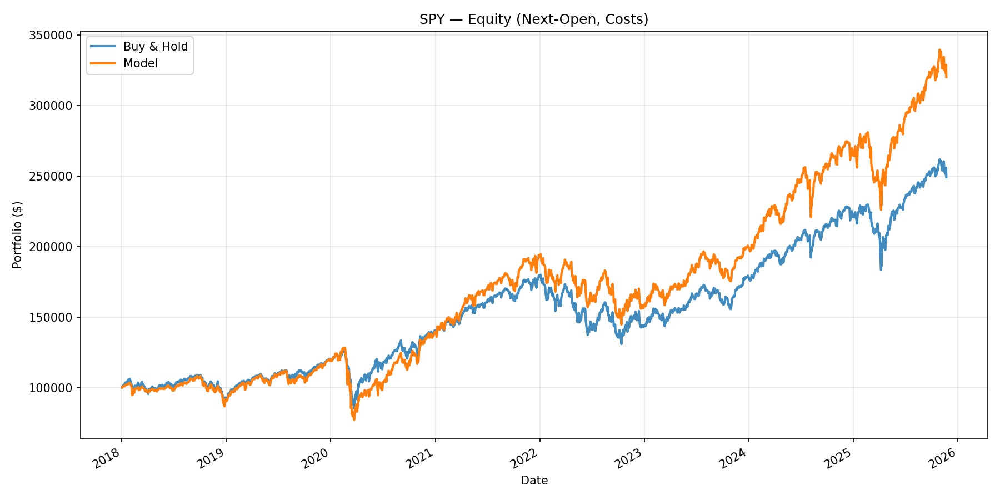

# ML Next-Open Trading Strategy

A machine learning based trading strategy that predicts next-open price direction using a Gradient Boosting Classifier and a rolling walk-forward backtest.  
The project is fully leakage-safe, includes transaction costs, and benchmarks performance against a Buy & Hold strategy.

---

## Overview

In this project, I applied a supervised machine learning approach to short-term market prediction.  
The pipeline avoids look-ahead bias, retrains periodically on rolling data, and executes trades at the next open with commissions and slippage applied.

---

## Features

- Leakage-safe feature set (no future data leakage)
- Rolling walk-forward model retraining
- Fixed-horizon labels (Open[t+H] > Open[t])
- Compact but expressive features: returns, gaps, momentum, volatility, RSI, SMAs, vol-adjusted momentum
- Long-only exposure with confidence-based tilts and optional trend gating
- Trading cost model including commissions and slippage
- Buy & Hold benchmark comparison
- Deterministic, reproducible results (fixed random seeds, locked dependencies)

---

## Installation

1. Clone the repository  
   git clone https://github.com/aummonji/ml-open-open-trading.git  
   cd ml-open-open-trading  

2. Install dependencies using uv (recommended)  
   pip install uv  
   uv sync  

3. To add new dependencies later  
   uv add <package-name>  

---

## Running the Strategy

From the project root directory, run:  
uv run python scripts/ml_trading.py  

The script will:
1. Download historical data for the configured ticker (default: SPY)
2. Build leakage-safe features and labels
3. Train a Gradient Boosting model with rolling walk-forward retraining
4. Backtest the next-open execution strategy with costs
5. Save the resulting equity curve plot to the artifacts folder

---

## What to expect?

### Simple ML Next-Open Strategy 
FAST_MODE=True | START=2018-01-01 | H=5 | TREND=loose
Loaded 1500 rows: 2018-01-02 → 2024-10-15
Direction accuracy (H=5, 0.5 cut): 0.63
Saved plot: artifacts/equity_SPY.png
DONE

---

## Example Output

Performance metrics include:
- CAGR  
- Sharpe Ratio  
- Annualized Volatility  
- Max Drawdown  
- Directional Accuracy  

---

## Configuration

All configurable parameters are located near the top of scripts/ml_trading.py

Parameter | Description | Default  
-----------|--------------|----------  
TICKER | Asset symbol | "SPY"  
START | Backtest start date | "2018-01-01"  
H | Prediction horizon (days) | 5  
FAST_MODE | Shorter backtest for quick runs | True  
TREND_MODE | "none", "loose", or "strict" trend gating | "loose"  
FEE_BPS | Commission per trade (bps) | 0.5  
SLIP_BPS | Slippage cost (bps) | 0.2  
BASE_EXPOSURE | Base long exposure | 1.0  
THR_UP / THR_DN | Confidence thresholds for tilts | 0.6 / 0.4  

---

## Methodology

Feature Engineering:
- Log returns (ret_cc_1), overnight gap (gap_oc), and momentum (mom_5)
- Realized volatility (vol_20)
- RSI-14 using Wilder’s EMA
- Short and medium SMAs (10, 50)
- Volatility-adjusted momentum (vam_20)

Model:
- Gradient Boosting Classifier (scikit-learn)
- 300 estimators, depth 3, learning rate 0.05, subsample 0.9
- Retrained every 10 trading days using a capped rolling window
- Recency-weighted sample training for stability

Execution:
- Long-only baseline exposure with confidence-based tilts
- Optional trend gating (SMA-based up/down filter)
- Trading costs: 0.5 bps commission, 0.2 bps slippage
- Next-open execution logic with cost accounting

---

## Outputs

- Equity curve plot: artifacts/equity_SPY.png  
- Performance metrics printed in console summary  
- Directional accuracy included for reference  

---

## Dependencies

Managed via uv:
- numpy  
- pandas  
- matplotlib  
- scikit-learn  
- yfinance  

Install or modify dependencies with:  
uv add <package-name>  

---

## Disclaimer

This project is for educational and research purposes only.  
It is not financial advice or a trading recommendation.  
Use responsibly.

---
## License

Released under the MIT License.  
See the LICENSE file for full details.

---

Developed by [Aum Monji](https://github.com/aummonji)
